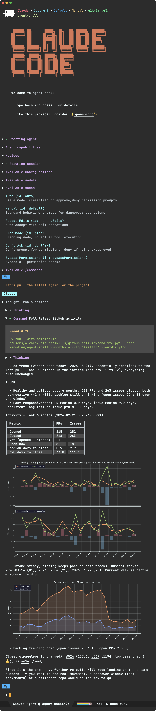

#+TITLE: Emacs Agent Shell
#+AUTHOR: Álvaro Ramírez

[[https://melpa.org/#/agent-shell][file:https://melpa.org/packages/agent-shell-badge.svg]]

👉 [[https://github.com/sponsors/xenodium][Support this work via GitHub Sponsors]] by [[https://github.com/xenodium][@xenodium]] (check out my [[https://xenodium.com][blog]])

* This project needs your funding

As you pay for those useful LLM tokens, consider [[https://github.com/sponsors/xenodium][sponsoring]] development and maintenance of this project. With your help, I can make this effort more [[https://github.com/sponsors/xenodium][sustainable]].

Thank you!

[[https://xenodium.com/][Alvaro]]

* agent-shell

A native Emacs shell to interact with LLM agents powered by ACP ([[https://agentclientprotocol.com][Agent Client Protocol]]).

With agent-shell, you can interact with any ACP-driven agent like:

- [[https://code.claude.com/docs/en/overview][Claude Agent]] (Anthropic)
- [[https://github.com/agentclientprotocol/codex-acp][Codex]] (OpenAI)
- [[https://github.com/google-gemini/gemini-cli][Gemini CLI]] (Google)
- [[https://goose-docs.ai/docs/getting-started/installation][Goose]]
- [[https://docs.x.ai/docs/overview][Grok Build]] (xAI)
- [[https://cursor.com/docs/cli][Cursor]]
- [[https://www.kimi.com/code][Kimi Code CLI]]
- [[https://www.codebuddy.ai][CodeBuddy]]
- [[https://kiro.dev][Kiro CLI]]
- [[https://github.com/QwenLM/qwen-code][Qwen Code]]
- [[https://docs.augmentcode.com/cli/overview][Auggie]]
- [[https://github.com/mistralai/mistral-vibe][Mistral Vibe]]
- [[https://factory.ai][Factory Droid]]
- [[https://github.com/svkozak/pi-acp][Pi]]
- [[https://github.com/can1357/oh-my-pi][Oh My Pi]]
- [[https://opencode.ai][Opencode]]
- [[https://antigravity.google/docs/ide/extensions][Antigravity]] (Google)

[[https://www.youtube.com/watch?v=R2Ucr3amgGg][agent-shell - YouTube]]

[[https://www.youtube.com/watch?v=R2Ucr3amgGg][file:yt.png]]

[[https://www.youtube.com/watch?v=ymMlftdGx4I][agent-shell + Claude Skills - YouTube]]

[[https://www.youtube.com/watch?v=ymMlftdGx4I][https://img.youtube.com/vi/ymMlftdGx4I/0.jpg]]

[[https://www.youtube.com/watch?v=HJQ86HuSIJI][agent-shell + Claude Skills + Charts - YouTube]]

[[https://www.youtube.com/watch?v=HJQ86HuSIJI][https://img.youtube.com/vi/HJQ86HuSIJI/0.jpg]]

[[https://www.youtube.com/watch?v=7fdHeUoRRgg][Bending Emacs Episode 14: Prototyping iOS apps with agent-shell, artist-mode, and Claude Skills - YouTube]]

[[https://www.youtube.com/watch?v=7fdHeUoRRgg][https://img.youtube.com/vi/7fdHeUoRRgg/0.jpg]]

* News

Do take a look at all these blog posts as they showcase most =agent-shell= features.

- [[https://xenodium.com/agent-shell-0-63-updates][agent-shell 0.63 updates]].
- [[https://xenodium.com/agent-shell-0-55-updates][agent-shell 0.55 updates]].
- [[https://xenodium.com/agent-shell-0-47-1-updates][agent-shell 0.47 updates]].
- [[https://xenodium.com/agent-shell-0-25-updates][agent-shell 0.25 updates]].
- [[https://xenodium.com/agent-shell-016-improvements-melpa][agent-shell 0.17 improvements + MELPA]].
- [[https://xenodium.com/agent-shell-0-5-improvements][agent-shell 0.5 improvements]].
- [[https://xenodium.com/introducing-agent-shell][Introducing Emacs agent-shell (powered by ACP)]].
- [[https://xenodium.com/introducing-acpel][Introducing acp.el]].

* Related projects

=agent-shell= relies on [[https://github.com/xenodium/acp.el][acp.el]] to communicate with agents via ACP ([[https://agentclientprotocol.com/][Agent Client Protocol]]).

We now have a handful of additional packages to extend the =agent-shell= experience:

- [[https://github.com/xenodium/emacs-skills][emacs-skills]]: Claude Agent skills for Emacs.
- [[https://github.com/ElleNajt/agent-shell-to-go][agent-shell-to-go]]: Interact with =agent-shell= sessions from your mobile or any other device via Slack.
- [[https://github.com/Embedded-Focus/agent-circus][agent-circus]]: Run AI coding agents in sandboxed Docker containers.
- [[https://github.com/cmacrae/agent-shell-sidebar][agent-shell-sidebar]]: A sidebar add-on for =agent-shell=.
- [[https://github.com/dcluna/agent-shell-bookmark][agent-shell-bookmark]]: Bookmark support for agent-shell sessions.
- [[https://github.com/gveres/agent-shell-workspace][agent-shell-workspace]]: Dedicated tab-bar workspace for managing multiple =agent-shell= sessions.
- [[https://github.com/jethrokuan/agent-shell-manager][agent-shell-manager]]: Tabulated view and management of =agent-shell= buffers.
- [[https://github.com/nineluj/agent-review][agent-review]]: Code review interface for =agent-shell=.
- [[https://github.com/ultronozm/agent-shell-attention.el][agent-shell-attention.el]]: Mode-line attention tracker for =agent-shell=.
- [[https://github.com/xenodium/agent-shell-knockknock][agent-shell-knockknock]]: Notifications for =agent-shell= via [[https://github.com/konrad1977/knockknock][knockknock.el]].
- [[https://github.com/zackattackz/agent-shell-notifications][agent-shell-notifications]]: Desktop notifications for =agent-shell= events.
- [[https://github.com/ElleNajt/meta-agent-shell][meta-agent-shell]]: Multi-agent coordination system for =agent-shell= with inter-agent communication, task tracking, and project-level dispatching.
- [[https://github.com/cxa/agent-shell-macext][agent-shell-macext]]: macOS-specific enhancements for =agent-shell=.
- [[https://github.com/lllShamanlll/agent-shell-org-transcript][agent-shell-org-transcript]]: Org-mode transcripts for =agent-shell= sessions, with org-roam integration.
- [[https://github.com/eddof13/ob-agent-shell][ob-agent-shell]]: Org Babel backend for executing =agent-shell= source blocks.
- [[https://github.com/Marx-A00/agent-recall][agent-recall]]: Search, browse, and resume =agent-shell= conversation transcripts.
- [[https://github.com/lgmoneda/agent-shell-pet][agent-shell-pet]]: Codex-like pets that broadcast agent-shell session states.
- [[https://github.com/alberti42/agent-shell-math-renderer][agent-shell-math-renderer]]: Render LaTeX math equations as SVGs in =agent-shell=.
- [[https://github.com/junyi-hou/agent-shell-tramp][agent-shell-tramp]]: Tramp integration for =agent-shell=.
- [[https://github.com/nohzafk/agent-shell-hud][agent-shell-hud]]: Real-time =agent-shell= status overlay via a floating dashboard.
- [[https://github.com/timfel/agent-shell-desktop.el][agent-shell-desktop]]: Desktop save mode integration for =agent-shell=. Saves and resumes shells by folder, config, and session id.
- [[https://github.com/ultronozm/agent-shell-links.el][agent-shell-links.el]]: Bookmarks and Org links for =agent-shell= sessions.
- [[https://github.com/wandersoncferreira/agent-shell-dashboard][agent-shell-dashboard]]: A landing page for =agent-shell=.
- [[https://github.com/SreenivasVRao/agent-shell-hq][agent-shell-hq]]: A heads-up display and peek interface for managing multiple =agent-shell= sessions, organized by project.
- [[https://github.com/Jamie-Cui/agent-shell-permission-transient][agent-shell-permission-transient]]: A compact Transient interface for responding to queued agent-shell permission requests.
- [[https://github.com/tychoish/agent-shell-queue][agent-shell-queue]]: A flexible prompt/shell queue for =agent-shell= sessions.

* Articles
- 20Y: [[https://20y.hu/~slink/journal/agent-shell/index.html][Agentic development workflow in Emacs]]
- Skye: [[https://skyefreeman.com/blog/2026/04/15/how-im-using-llms-with-emacs][How I'm using LLM's via Emacs]].
- sincebyte: [[https://neoemacs.com/posts/agent-shell-cursor-agent-cli/][Agent Shell Cursor Agent Cli]].
- Naputo: [[https://blog.n-daisuke897.com/posts/2026-03-01-agent-shell-session-selection/][How to Select Sessions When Starting the agent-shell ACP Client Running on Emacs]]
- vandee: [[https://www.vandee.art/blog/2026-01-23-my-agent-practice-with-opencode-in-emacs.html][My Agent Practice with OpenCode in Emacs]].
- Fedora Project Wiki: [[https://fedoraproject.org/wiki/SIGs/AI-ML#agent-shell][AI/ML Special Interest Group]].

* Icons

Thanks to [[https://github.com/lobehub/lobe-icons][Lobe Icons]] for the lovely icons.

* Setup

** External dependencies

*** Claude Agent SDK

For Anthropic's [[https://code.claude.com/docs/en/overview][Claude Agent]] (formerly known as the Claude Code), follow [[https://github.com/agentclientprotocol/claude-agent-acp][claude-agent-acp instructions]], typically something like:

#+begin_src bash
npm install -g @agentclientprotocol/claude-agent-acp
#+end_src

*Note:* The =-g= flag is required to install the binary globally so it's available in your PATH. After installation, verify it's available by running =which claude-agent-acp= in your terminal.

Optionally: You may also need [[https://code.claude.com/docs/en/overview][Claude Agent]] itself if you want to use a Claude subscription (run the CLI outside of Emacs at least once to log in to your subscription and then use =agent-shell= from Emacs). Follow Claude Agent's [[https://code.claude.com/docs/en/overview#get-started][get started]] for installation.

*** Codex

For OpenAI's Codex, install [[https://github.com/agentclientprotocol/codex-acp][@agentclientprotocol/codex-acp]] (=npm install -g @agentclientprotocol/codex-acp=) and ensure the =codex-acp= executable is in PATH.

*** Gemini CLI

For Google's [[https://github.com/google-gemini/gemini-cli][Gemini CLI]], be sure to get a recent release supporting the =--experimental-acp= flag.

*** Goose

For Goose CLI, install [[https://goose-docs.ai/docs/getting-started/installation][goose]] and ensure the =goose= executable is in PATH.

*** Grok Build (xAI)

For [[https://docs.x.ai/docs/overview][Grok Build]], install the Grok CLI so =grok= is on =PATH= (the installer typically puts it at =~/.grok/bin=). Authenticate once via the CLI login flow (credentials live in =~/.grok/auth.json=).

Grok Build speaks ACP over stdio:

#+begin_src bash
grok agent stdio
#+end_src

Optional flags (set via =agent-shell-xai-acp-command=):

#+begin_src bash
grok agent -m grok-build stdio
grok agent --always-approve stdio
#+end_src

See also the [[https://zed.dev/acp/agent/grok-build][Zed ACP registry listing]] for Grok Build.

*** Cursor

For Cursor agent, install the official [[https://cursor.com/docs/cli][Cursor CLI]] and ensure the =agent= executable is in PATH. =agent-shell= uses its official ACP server (=agent acp=).

A recent Cursor CLI is required (the =acp= subcommand was added in 2026). Older CLIs won't expose =agent acp=.

*** Kimi Code CLI

For Kimi Code CLI, install with:

#+begin_src bash
curl -L code.kimi.com/install.sh | bash
#+end_src

See https://www.kimi.com/code for details.

*** CodeBuddy

For CodeBuddy agent, install the CodeBuddy CLI and ensure ACP mode is available.
For example:

#+begin_src bash
codebuddy --acp
#+end_src

See https://www.codebuddy.ai/docs/zh/ide/Getting-Started/Installation for details.

*** Kiro CLI

For Kiro CLI, install with:

#+begin_src bash
curl -fsSL https://cli.kiro.dev/install | bash
#+end_src

See https://kiro.dev/docs/cli/acp/ for details.

*** Qwen Code

For Qwen Code, install with:

#+begin_src bash
npm install -g @qwen-code/qwen-code@latest
#+end_src

See https://github.com/QwenLM/qwen-code for details.

*** Auggie

For Auggie CLI, install with:

#+begin_src bash
npm install -g @augmentcode/auggie
#+end_src

See https://docs.augmentcode.com/cli/overview for details.
*** Mistral Vibe

For Mistral Vibe, install with:

#+begin_src bash
uv tool install mistral-vibe
#+end_src

See https://github.com/mistralai/mistral-vibe for details.

*** Factory Droid

For Factory Droid, install Droid:

#+begin_src bash
curl -fsSL https://app.factory.ai/cli | sh
#+end_src

See https://factory.ai for details.

*** Pi

For Pi coding agent, install the =pi-acp= adapter:

#+begin_src bash
npm install -g pi-acp
#+end_src

See https://github.com/svkozak/pi-acp for details.
*** Oh My Pi (=omp=)

For the =omp= agent, install with:

#+begin_src bash
bun install -g @oh-my-pi/pi-coding-agent
#+end_src

See https://github.com/can1357/oh-my-pi for details.

*** Antigravity

For Antigravity, download the =agy_acp_server= binary for your platform from the [[https://github.com/agentclientprotocol/registry/tree/main/antigravity-acp][ACP registry entry]] and make sure it's on your =PATH= (or set =agent-shell-antigravity-acp-command= to an absolute path).

Alternatively, you can bootstrap the antigravity tool with the following function:

#+begin_src emacs-lisp
  (defun agent-shell-antigravity-bootstrap (&optional force)
    "Download and install the latest Antigravity ACP server binary."
    (interactive "P")
    (let* ((arch (pcase (car (split-string system-configuration "-"))
                   ((or "x86_64" "amd64") "x86_64")
                   ((or "aarch64" "arm64") "aarch64")
                   (a a)))
           (os (pcase system-type ('darwin "darwin") ('windows-nt "windows") (_ "linux")))
           (platform (format "%s-%s" os arch))
           (install-dir (agent-shell-cache-dir "antigravity" platform))
           (bin-name (file-name-nondirectory (car agent-shell-antigravity-acp-command)))
           (bin-path (expand-file-name bin-name install-dir)))
      (unless (and (not force) (file-executable-p bin-path))
        (message "Antigravity: bootstrapping server for %s..." platform)
        (make-directory install-dir t)
        (let* ((reg-url "https://raw.githubusercontent.com/agentclientprotocol/registry/main/antigravity-acp/agent.json")
               (reg (with-temp-buffer
                      (url-insert-file-contents reg-url)
                      (json-parse-buffer :object-type 'alist)))
               (archive-url (map-nested-elt reg `(distribution binary ,(intern platform) archive)))
               (zip (expand-file-name "server.zip" install-dir)))
          (url-copy-file archive-url zip t)
          (call-process "unzip" nil nil nil "-o" "-q" zip "-d" install-dir)
          (delete-file zip)
          (set-file-modes bin-path #o755)))
      (setq agent-shell-antigravity-acp-command
            (cons bin-path (cdr agent-shell-antigravity-acp-command)))
      (message "Antigravity: using ACP server at %s" bin-path)
      bin-path))
#+end_src

See https://antigravity.google/docs/ide/extensions for details.

*** Opencode + local ollama models

For opencode coding agent, install with:

#+begin_src bash
curl -fsSL https://opencode.ai/install | bash
#+end_src

See https://opencode.ai/ for details.

For local ollama models, sudo permission is needed to initialize ~ollama.service~. The following will install ollama and a local Qwen2.5:7b model.

#+begin_src bash
curl -fsSL https://ollama.com/install.sh | sh
ollama pull qwen2.5:7b
#+end_src

If you are behind a network proxy, ~ollama pull~ will timeout. You then need to add proxy settings inside ~/etc/systemd/system/ollama.service~

See https://ollama.com/ for details

** Installation

=agent-shell= is powered by built-in =comint-shell=, via [[https://github.com/xenodium/shell-maker][shell-maker]], available on [[https://melpa.org/#/shell-maker][MELPA]].

Both [[https://melpa.org/#/agent-shell][agent-shell]] and its dependency [[https://melpa.org/#/acp][acp.el]] are now available on MELPA.

You can install via:

#+begin_src emacs-lisp
  (use-package agent-shell
      :ensure t
      :ensure-system-package
      ;; Add agent installation configs here
      ((claude . "brew install claude-code")
       (claude-agent-acp . "npm install -g @agentclientprotocol/claude-agent-acp")))
#+end_src

This will automatically install the required dependencies ([[https://melpa.org/#/acp][acp.el]] and [[https://melpa.org/#/shell-maker][shell-maker]]).

*** Optional: image utilities

Pasting images from the clipboard (=agent-shell-send-clipboard-image= or =yank= or =C-y=) and capturing screenshots (=agent-shell-send-screenshot=) rely on external tools. Install the ones for your platform:

| Platform        | Clipboard paste                          | Screenshot capture           |
|-----------------+------------------------------------------+------------------------------|
| macOS           | =brew install pngpaste=                    | =screencapture= (preinstalled) |
| Linux (Wayland) | =wl-paste= (e.g. =apt install wl-clipboard=) | =import= (from ImageMagick)    |
| Linux (X11)     | =apt install xclip=                        | =import= (from ImageMagick)    |
| Windows         | =powershell=                               | (not bundled)                |

Handlers are detected at runtime via =executable-find=. See =agent-shell-clipboard-image-handlers= and =agent-shell-screenshot-command= to customize.

*** Doom Emacs

If you are using Doom Emacs and would like to use the =package!= macro:

#+begin_src emacs-lisp
(package! shell-maker)
(package! acp)
(package! agent-shell)
#+end_src

Run =doom sync= and restart.

Include =require= before configuration:

#+begin_src emacs-lisp
(require 'acp)
(require 'agent-shell)
;; rest of config...
#+end_src

** Configuration

Configure authentication for the agent providers you want to use.

*** Environment variables

Pass environment variables to the spawned agent process by customizing the `agent-shell-*-environment` variable with `agent-shell-make-environment-variables`. The helper accepts key/value pairs and exports them when the agent starts.

#+begin_src emacs-lisp
(setq agent-shell-anthropic-claude-environment
      (agent-shell-make-environment-variables
       "ANTHROPIC_API_KEY" (auth-source-pass-get 'secret "anthropic-api-key")
       "HTTPS_PROXY" "http://proxy.example.com:8080"))
#+end_src

**** Inheriting environment variables

By default, the agent process starts with a minimal environment. To inherit environment variables from the parent Emacs process, use the `:inherit-env t` parameter in `agent-shell-make-environment-variables`:

#+begin_src emacs-lisp
  (setenv "ANTHROPIC_API_KEY" (auth-source-pass-get 'secret "anthropic-api-key"))

  (setq agent-shell-anthropic-claude-environment
        (agent-shell-make-environment-variables :inherit-env t))
#+end_src

This ensures that environment variables like `PATH`, `HOME`, and others from your Emacs session are available to the agent process, while still allowing you to override or add specific variables.

**** Loading environment variables from files

You can load environment variables from .env files using the `:load-env` parameter. This supports both single and multiple files:

#+begin_src emacs-lisp
  ;; Load from a single .env file
  (setq agent-shell-anthropic-claude-environment
        (agent-shell-make-environment-variables
         :load-env "~/.env"
         "CUSTOM_VAR" "custom_value"))

  ;; Load from multiple .env files
  (setq agent-shell-anthropic-claude-environment
        (agent-shell-make-environment-variables
         :load-env '("~/.env" ".env.local")
         :inherit-env t))
#+end_src

The .env files should contain variables in the format `KEY=value`, with one variable per line. Comments (lines starting with `#`) and empty lines are ignored.

*** Anthropic Claude

For login-based authentication (default):

#+begin_src emacs-lisp
(setq agent-shell-anthropic-authentication
      (agent-shell-anthropic-make-authentication :login t))
#+end_src

For API key authentication:

#+begin_src emacs-lisp
;; With string
(setq agent-shell-anthropic-authentication
      (agent-shell-anthropic-make-authentication :api-key "your-anthropic-api-key-here"))

;; With function
(setq agent-shell-anthropic-authentication
      (agent-shell-anthropic-make-authentication
       :api-key (lambda () (auth-source-pass-get 'secret "anthropic-api-key"))))
#+end_src

For OAuth token authentication (the =CLAUDE_CODE_OAUTH_TOKEN= we get from =claude setup-token=):

#+begin_src emacs-lisp
;; With string
(setq agent-shell-anthropic-authentication
      (agent-shell-anthropic-make-authentication :oauth "your-oauth-token-here"))

;; With function
(setq agent-shell-anthropic-authentication
      (agent-shell-anthropic-make-authentication
       :oauth (lambda () (auth-source-pass-get "secret" "anthropic-oauth-token"))))
#+end_src

For alternative Anthropic-compatible API endpoints, configure via environment variables:

#+begin_src emacs-lisp
  (setq agent-shell-anthropic-claude-environment
        (agent-shell-make-environment-variables
         "ANTHROPIC_BASE_URL" "https://api.moonshot.cn/anthropic"
         "ANTHROPIC_MODEL" "kimi-k2-turbo-preview"
         "ANTHROPIC_SMALL_FAST_MODEL" "kimi-k2-turbo-preview"))
#+end_src

*** Antigravity

For login-based authentication (default, Google account):

#+begin_src emacs-lisp
(setq agent-shell-antigravity-authentication
      (agent-shell-antigravity-make-authentication :login t))
#+end_src

For API key authentication:

#+begin_src emacs-lisp
;; With string
(setq agent-shell-antigravity-authentication
      (agent-shell-antigravity-make-authentication :api-key "your-gemini-api-key-here"))

;; With function
(setq agent-shell-antigravity-authentication
      (agent-shell-antigravity-make-authentication
       :api-key (lambda () (auth-source-pass-get 'secret "gemini-api-key"))))
#+end_src

For Gemini Enterprise authentication:

#+begin_src emacs-lisp
(setq agent-shell-antigravity-authentication
      (agent-shell-antigravity-make-authentication :business t))
#+end_src

For Gemini Enterprise Agent Platform authentication:

#+begin_src emacs-lisp
(setq agent-shell-antigravity-authentication
      (agent-shell-antigravity-make-authentication :agent-platform t))
#+end_src

For no authentication (when managed externally):

#+begin_src emacs-lisp
(setq agent-shell-antigravity-authentication
      (agent-shell-antigravity-make-authentication :none t))
#+end_src

*** Google Gemini

For login-based authentication (default):

#+begin_src emacs-lisp
(setq agent-shell-google-authentication
      (agent-shell-google-make-authentication :login t))
#+end_src

For API key authentication:

#+begin_src emacs-lisp
;; With string
(setq agent-shell-google-authentication
      (agent-shell-google-make-authentication :api-key "your-google-api-key-here"))

;; With function
(setq agent-shell-google-authentication
      (agent-shell-google-make-authentication
       :api-key (lambda () (auth-source-pass-get 'secret "google-api-key"))))
#+end_src

For Vertex AI authentication:

#+begin_src emacs-lisp
(setq agent-shell-google-authentication
      (agent-shell-google-make-authentication :vertex-ai t))
#+end_src

*** OpenAI Codex

For login-based authentication (default):

#+begin_src emacs-lisp
(setq agent-shell-openai-authentication
      (agent-shell-openai-make-authentication :login t))
#+end_src

For API key authentication:

#+begin_src emacs-lisp
;; With string
(setq agent-shell-openai-authentication
      (agent-shell-openai-make-authentication :api-key "your-openai-api-key-here"))

;; With function
(setq agent-shell-openai-authentication
      (agent-shell-openai-make-authentication
       :api-key (lambda () (auth-source-pass-get 'secret "openai-api-key"))))
#+end_src

*** Goose

By default, authentication is handled by Goose's built-in configuration.
This needs no =agent-shell= configuration.

Optionally, pass an OpenAI API key from =agent-shell= instead:

#+begin_src emacs-lisp
;; With string
(setq agent-shell-goose-authentication
      (agent-shell-make-goose-authentication :openai-api-key "your-openai-api-key-here"))

;; With function
(setq agent-shell-goose-authentication
      (agent-shell-make-goose-authentication
       :openai-api-key (lambda () (auth-source-pass-get 'secret "openai-api-key"))))
#+end_src

*** Qwen Code

For OAuth login-based authentication:

#+begin_src emacs-lisp
(setq agent-shell-qwen-authentication
      (agent-shell-qwen-make-authentication :login t))
#+end_src

For an OpenAI-compatible provider (for example OpenRouter), pass the API key and set the base URL and model via =agent-shell-qwen-environment=:

#+begin_src emacs-lisp
;; With string
(setq agent-shell-qwen-authentication
      (agent-shell-qwen-make-authentication :openai-api-key "your-openai-api-key-here"))

;; With function
(setq agent-shell-qwen-authentication
      (agent-shell-qwen-make-authentication
       :openai-api-key (lambda () (auth-source-pass-get 'secret "openrouter-api-key"))))

(setq agent-shell-qwen-environment
      (agent-shell-make-environment-variables
       "OPENAI_BASE_URL" "https://openrouter.ai/api/v1"
       "OPENAI_MODEL" "x-ai/grok-4.3"))
#+end_src

*** Cursor

By default authentication is handled externally: run =agent login= once outside Emacs and agent-shell uses that existing login (it sends no ACP authenticate request). This needs no configuration.

Optionally, have agent-shell drive login-based authentication (=cursor_login=):

#+begin_src emacs-lisp
(setq agent-shell-cursor-authentication
      (agent-shell-cursor-make-authentication :login t))
#+end_src

For API key authentication (passed via the =CURSOR_API_KEY= environment variable):

#+begin_src emacs-lisp
;; With string
(setq agent-shell-cursor-authentication
      (agent-shell-cursor-make-authentication :api-key "your-cursor-api-key-here"))

;; With function
(setq agent-shell-cursor-authentication
      (agent-shell-cursor-make-authentication
       :api-key (lambda () (auth-source-pass-get 'secret "cursor-api-key"))))
#+end_src

For auth token authentication (passed via the =CURSOR_AUTH_TOKEN= environment variable):

#+begin_src emacs-lisp
(setq agent-shell-cursor-authentication
      (agent-shell-cursor-make-authentication :auth-token "your-cursor-auth-token"))
#+end_src

For no authentication (already authenticated externally):

#+begin_src emacs-lisp
(setq agent-shell-cursor-authentication
      (agent-shell-cursor-make-authentication :none t))
#+end_src

*** Auggie

For login-based authentication (default):

#+begin_src emacs-lisp
(setq agent-shell-auggie-authentication
      (agent-shell-make-auggie-authentication :login t))
#+end_src

For no authentication (when using alternative authentication methods):

#+begin_src emacs-lisp
(setq agent-shell-auggie-authentication
      (agent-shell-make-auggie-authentication :none t))
#+end_src

*** Mistral Vibe

For API key authentication:

#+begin_src emacs-lisp
;; With string
(setq agent-shell-mistral-authentication
      (agent-shell-mistral-make-authentication :api-key "your-mistral-api-key-here"))

;; With function (reusing the API key configured in vibe)
(setq agent-shell-mistral-authentication
      (agent-shell-mistral-make-authentication
       :api-key (lambda ()
	          (string-trim
		   (shell-command-to-string "source ~/.vibe/.env; echo $MISTRAL_API_KEY")))))
#+end_src

*** Opencode + local ollama Qwen2.5

If ~opencode~ is not found by ~agent-shell~, you can add it to the search path

#+begin_src emacs-lisp
(use-package agent-shell
      :ensure t
      :config
         (add-to-list 'exec-path "~/.opencode/bin/"))
#+end_src

To register the local Qwen2.5:7b model in opencode, two files needs to be edited:

~/.config/opencode/opencode.json~
#+BEGIN_SRC js
     {
         "$schema": "https://opencode.ai/config.json",
         "permission": {
     	"edit": "ask",
     	"bash": "ask",
     	"webfetch": "allow"
         },
        "provider": {
            "ollama": {
     	   "name": "qwen2.5:7b",
     	   "npm": "@ai-sdk/openai-compatible",
                "options": {
                    "baseURL": "http://localhost:11434/v1"
                },
                "models": {
           	       "qwen2.5:7b": { "name": "Qwen2.5 7b" }
                }
            }
        }
     }
#+END_SRC

and a dummy auth file ~/.local/share/opencode/auth.json~

#+begin_src js
{
    "ollama": {
      "type": "api",
  	  "key": "ollama"
    }
}
#+end_src

Huge thanks for /gdindi/ for finding and and describing this in https://github.com/xenodium/agent-shell/issues/526

*** Customizing Available Agents

By default, =agent-shell= includes configurations for all supported agents (Claude Agent, Gemini CLI, Codex, Goose, Grok Build, Cursor, CodeBuddy, Qwen Code, and Auggie). You can customize which agents are available through the =agent-shell-agent-configs= variable.

** Usage

*** Quick Start

=M-x agent-shell= - Start or reuse any of the known agents.

You can select and start any of the known agent shells (see =agent-shell-agent-configs=) via the =agent-shell= interactive command and enables reusing existing shells when available. With a prefix argument (=C-u M-x agent-shell=), it forces starting a new shell session, thus instantiating multiple agent shells.

*** Viewport interaction

Viewport is an alternative interface for composing prompts and viewing one request/response interaction at a time.  It uses a separate buffer named after its associated shell with =" [viewport]"= appended.  This buffer switches between =agent-shell-viewport-edit-mode= while composing and =agent-shell-viewport-view-mode= while reading.

Use one of these entry points to create and initialize the viewport buffer:

- From an agent shell, type =C-c C-o= (=agent-shell-other-buffer=).  At the live prompt this opens the viewport for composing; from an earlier interaction it opens the viewport at that interaction.  Use =C-c C-o= again to return to the shell (=o= also works from viewport view mode).
- Run =M-x agent-shell-prompt-compose= to compose in a dedicated buffer.  With the default configuration, =C-c C-c= sends or queues the prompt and dismisses the compose window.
- Set =agent-shell-prefer-viewport-interaction= to make the normal =agent-shell= command and related commands prefer the viewport:

#+begin_src emacs-lisp
(setopt agent-shell-prefer-viewport-interaction t)
#+end_src

In edit mode, =C-c C-c= sends or queues the prompt and switches to view mode when viewport interaction is preferred.  Use =C-u C-c C-c= to send or queue while keeping the compose buffer open, =C-c C-p= to peek at the latest interaction without losing the draft, =C-c C-k= to cancel, and =C-c C-h= for help.

In view mode, use =r= to compose a reply, =R= to quote the response in a reply, =b= / =f= to move between interactions, =p= / =n= to move between items, =?= for help, and =q= to bury the viewport.

#+begin_quote
[!NOTE]

Do not invoke =agent-shell-viewport-edit-mode= or =agent-shell-viewport-view-mode= directly in an agent shell buffer.  They are major modes installed by the entry points above on the separate viewport buffer, not commands for converting the shell buffer.
#+end_quote

*** Specific Agent Commands

Start a specific agent shell session directly:

- =M-x agent-shell-antigravity-start-agent= - Start an Antigravity agent session
- =M-x agent-shell-anthropic-start-claude-code= - Start a Claude Agent session
- =M-x agent-shell-auggie-start-agent= - Start an Auggie agent session
- =M-x agent-shell-codebuddy-start-agent= - Start a CodeBuddy agent session
- =M-x agent-shell-openai-start-codex= - Start a Codex agent session
- =M-x agent-shell-google-start-gemini= - Start a Gemini agent session
- =M-x agent-shell-goose-start-agent= - Start a Goose agent session
- =M-x agent-shell-xai-start-grok= - Start a Grok Build (xAI) agent session
- =M-x agent-shell-cursor-start-agent= - Start a Cursor agent session
- =M-x agent-shell-kiro-start-agent= - Start a Kiro CLI agent session
- =M-x agent-shell-mistral-start-vibe= - Start a Mistral Vibe agent session
- =M-x agent-shell-qwen-start= - Start a Qwen Code agent session
- =M-x agent-shell-droid-start-agent= - Start a Factory Droid agent session
- =M-x agent-shell-pi-start-agent= - Start a Pi coding agent session

*** Setting a default agent for all new shells

You can set a default agent to use for all new shells started via =agent-shell= like so:

#+begin_src emacs-lisp
(setq agent-shell-preferred-agent-config (agent-shell-anthropic-make-claude-code-config))
#+end_src

Or by identifier (e.g. Grok Build):

#+begin_src emacs-lisp
(setq agent-shell-preferred-agent-config 'grok-build)
#+end_src

*** Configuring MCP servers

You can configure MCP servers directly via =agent-shell=. This allows you to avoid having to repeat
configurations across every agent that you use.

#+begin_src emacs-lisp
  (setq agent-shell-mcp-servers
        '(((name . "notion")
           (type . "http")
           (headers . [])
           (url . "https://mcp.notion.com/mcp"))))
#+end_src

** Running agents in Devcontainers / Docker containers (Experimental)

=agent-shell= provides rudimentary support for running agents and shell commands in containers.

Use =agent-shell-command-prefix= to prefix the command that starts the agent, or a shell command that should be run so it is executed inside the container.

*** Static command list

#+begin_src emacs-lisp
(setq agent-shell-command-prefix '("devcontainer" "exec" "--workspace-folder" "."))
#+end_src

*** Function-based configuration

For dynamic per-agent containers, provide a function that takes the current agent-shell buffer and returns the command list:

#+begin_src emacs-lisp
(setq agent-shell-command-prefix
      (lambda (buffer)
        (let ((config (agent-shell-get-config buffer)))
          (pcase (map-elt config :identifier)
            ('claude-code '("docker" "exec" "claude-dev" "--"))
            ('gemini-cli '("docker" "exec" "gemini-dev" "--"))
            (_ '("devcontainer" "exec" "."))))))
#+end_src

*** Per-session containers

You can use different containers for different shell sessions, even of the same agent type:

#+begin_src emacs-lisp
(setq agent-shell-command-prefix
      (lambda (buffer)
        ;; Different container based on project
        (if (string-match "project-a" (buffer-name buffer))
            '("docker" "exec" "project-a-dev" "--")
          '("docker" "exec" "project-b-dev" "--"))))
#+end_src

Note that any =:environment-variables= you may have passed to =acp-make-client= will not apply to the agent process running inside the container. It's expected to inject environment variables by means of your devcontainer configuration / Dockerfile.

Next, set an =agent-shell-path-resolver-function= that resolves container paths in the local working directory, and vice versa.
Agent shell provides the =agent-shell-devcontainer-resolve-path= function for use with devcontainers specifically: it reads the =workspaceFolder= specified in =.devcontainer/devcontainer.json=, or uses the default value of =/workspaces/<repository-name>= otherwise.

#+begin_src emacs-lisp
(setq agent-shell-path-resolver-function #'agent-shell-devcontainer-resolve-path)
#+end_src

Note that this allows the agent to access files on your local file-system. While care has been taken to restrict access to files in the local working directory, it's probably possible for a malicious agent to circumvent this restriction.

Optional: to prevent the agent running inside the container to access your local file-system altogether and to have it read/modify files inside the container directly, in addition to setting the resolver function, disable the "read/write text file" client capabilities:

#+begin_src emacs-lisp
(setq agent-shell-text-file-capabilities nil)
#+end_src

*** Data storage location

By default, agent-shell stores per-project data (transcripts, screenshots, etc.) under a =.agent-shell/= directory in the project root, and automatically adds that directory to =.gitignore= the first time it is created.  This is a one-time operation: removing the entry from =.gitignore= will not cause it to be re-added.  If you configure =agent-shell-dot-subdir-function= to store data outside the project =.agent-shell/= directory, agent-shell will not update the project's =.gitignore=.

You can change where this data is stored by setting =agent-shell-dot-subdir-function= to a custom function.  The function receives one argument, SUBDIR (e.g. ="screenshots"=), and must return the absolute path to that subdirectory (without creating it).

For example, to store data under =user-emacs-directory= instead of the project tree, flattening the project path into a directory name:

#+begin_src emacs-lisp
(defun my/agent-shell-dot-subdir (subdir)
  (let* ((cwd (string-remove-suffix "/" (agent-shell-cwd)))
         (sanitized (replace-regexp-in-string "/" "-" (string-remove-prefix "/" cwd))))
    (expand-file-name subdir (locate-user-emacs-file (concat "agent-shell/" sanitized)))))

(setopt agent-shell-dot-subdir-function #'my/agent-shell-dot-subdir)
#+end_src

This stores data at a path like =~/.emacs.d/agent-shell/home-user-src-myproject/screenshots/=.

*** Screenshots from clipboard

You can send a screenshot from your clipboard to your shell with =agent-shell-send-clipboard-image=. Call with =C-u= to =agent-shell-send-clipboard-image-to= to select from your shells. agent-shell relies on external programs to write an image from clipboard to file as configured in =agent-shell-clipboard-image-handlers=. Preconfigured handlers are
- =wl-paste= for Wayland desktops,
- =xclip= for Xorg,
- =pngpaste= for MacOS.
- =powershell= for Windows.

*** Inhibiting minor modes during file writes

Some minor modes (for example, =aggressive-indent-mode=) can interfere with an agent's edits.  Agent Shell can temporarily disable selected per-buffer minor modes while applying edits.

#+begin_src emacs-lisp
(setopt agent-shell-write-inhibit-minor-modes '(aggressive-indent-mode))
#+end_src

*** Keeping the system awake during long turns

Long agent turns can outlast the system idle-sleep timeout, suspending the machine (and the agent) before the turn completes. On Emacs 31.1 or later, =agent-shell-inhibit-system-sleep= (enabled by default) keeps the system awake for the duration of each turn and releases the block once the turn finishes, so the system is only kept awake while there is work in progress (the display is still allowed to blank). This relies on the built-in [[https://git.savannah.gnu.org/cgit/emacs.git/tree/lisp/system-sleep.el][=system-sleep=]] library and has no effect on earlier Emacs versions. It does not prevent "hard" sleep such as closing a laptop lid.

To turn it off:

#+begin_src emacs-lisp
(setopt agent-shell-inhibit-system-sleep nil)
#+end_src

All of the above settings can be applied on a per-project basis using [[https://www.gnu.org/software/emacs/manual/html_node/emacs/Directory-Variables.html][directory-local variables]].

** Key bindings

- =RET= - Submits prompt.
- =M-J= - Iserts newline.
- =C-c C-c= - Interrupt current agent operation
- =TAB and Shift-TAB= - Navigate interactive elements

  To customize =RET= binding behaviour, you can use something like:

  #+begin_src emacs-lisp :lexical no
    (use-package agent-shell
      :bind (:map agent-shell-mode-map
                  ("RET" . newline)
                  ("M-RET" . shell-maker-submit)))
  #+end_src

  Or if you prefer C-c C-c to send and C-c C-k to interrupt, use the following:

  #+begin_src emacs-lisp :lexical no
    (use-package agent-shell
      :bind (:map agent-shell-mode-map
                  ("RET" . newline)
                  ("C-c C-c" . shell-maker-submit)
                  ("C-c C-k" . agent-shell-interrupt)))
  #+end_src

*** Session controls

When the active agent advertises the corresponding session option, you can switch it from the shell buffer:

- =C-c C-v= - Set model.
- =C-c C-m= - Set session mode.
- =C-c C-t= - Set thought level (reasoning effort).
- =C-<tab>= - Cycle session mode.

The current selections are shown in the header right after the agent name; click any segment to open a popup menu. The thought level segment only appears for models that expose it (e.g. Claude Sonnet/Opus with effort levels; Codex's reasoning_effort).

From the viewport (=agent-shell-viewport-view-mode= / =agent-shell-viewport-edit-mode=), the same controls are bound to:

- View mode: =v= (model), =s= (mode), =t= (thought level).
- Edit mode: =C-c C-v=, =C-c C-m=, =C-c C-t=.

*** Evil
Evil users may want to rebind ~RET~ for inserting a new line in =insert
mode= and sending the prompt in =normal mode=.

Also, when viewing diffs (before accepting changes) it may be annoying
having to enter =insert mode= to send keys (~y/n/p/q/etc~). If this is
your case, you can make these buffers start in Emacs mode (you can
always go to Evil modes if you need to with ~C-z~).
#+begin_src emacs-lisp
  (use-package agent-shell
    :config
    ;; Evil state-specific RET behavior: insert mode = newline, normal mode = send
    (evil-define-key 'insert agent-shell-mode-map (kbd "RET") #'newline)
    (evil-define-key 'normal agent-shell-mode-map (kbd "RET") #'comint-send-input)

    ;; Configure *agent-shell-diff* buffers to start in Emacs state
    (add-hook 'diff-mode-hook
  	    (lambda ()
  	      (when (string-match-p "\\*agent-shell-diff\\*" (buffer-name))
  		(evil-emacs-state)))))
#+end_src

* Customizations

#+BEGIN_SRC emacs-lisp :results table :colnames '("Custom variable" "Description") :exports results
  (let ((rows))
    (mapatoms
     (lambda (symbol)
       (when (and (string-match "^agent-shell"
                                (symbol-name symbol))
                  (custom-variable-p symbol))
         (push `(,symbol
                 ,(car
                   (split-string
                    (or (documentation-property symbol 'variable-documentation)
                        (get (indirect-variable symbol)
                             'variable-documentation)
                        (get symbol 'variable-documentation)
                        "")
                    "\n")))
               rows))))
    (sort rows (lambda (a b)
                 (string< (symbol-name (car a))
                          (symbol-name (car b))))))
#+END_SRC

#+RESULTS:
| Custom variable                               | Description                                                                     |
|-----------------------------------------------+---------------------------------------------------------------------------------|
| agent-shell-activity-group-expand-by-default  | When activity group sections should be expanded.                                |
| agent-shell-agent-configs                     | The list of known agent configurations.                                         |
| agent-shell-antigravity-acp-command           | Command and parameters for the Antigravity ACP server.                          |
| agent-shell-antigravity-authentication        | Configuration for Antigravity authentication.                                    |
| agent-shell-antigravity-environment           | Environment variables for the Antigravity ACP server.                           |
| agent-shell-anthropic-authentication          | Configuration for Anthropic authentication.                                     |
| agent-shell-anthropic-claude-acp-command      | Command and parameters for the Anthropic Claude client.                         |
| agent-shell-anthropic-claude-command          | Command and parameters for the Anthropic Claude client.                         |
| agent-shell-anthropic-claude-environment      | Environment variables for the Anthropic Claude client.                          |
| agent-shell-anthropic-default-model-id        | Default Anthropic model ID.                                                     |
| agent-shell-anthropic-default-session-mode-id | Default Anthropic session mode ID.                                              |
| agent-shell-auggie-acp-command                | Command and parameters for the Auggie client.                                   |
| agent-shell-auggie-authentication             | Configuration for Auggie authentication.                                        |
| agent-shell-auggie-environment                | Environment variables for the Auggie client.                                    |
| agent-shell-buffer-name-format                | Format to use when generating agent shell buffer names.                         |
| agent-shell-busy-indicator-frames             | Frames for the busy indicator animation.                                        |
| agent-shell-clipboard-image-handlers          | Handlers for saving clipboard images to a file.                                 |
| agent-shell-completion-mode-hook              | Hook run after entering or leaving ‘agent-shell-completion-mode’.               |
| agent-shell-command-prefix                    | Command prefix for executing commands in a container.                           |
| agent-shell-context-sources                   | Sources to consider when determining M-x agent-shell automatic context.         |
| agent-shell-cursor-acp-command                | Command and parameters for the Cursor agent client.                             |
| agent-shell-cursor-environment                | Environment variables for the Cursor agent client.                              |
| agent-shell-display-action                    | Display action for agent shell buffers.                                         |
| agent-shell-droid-acp-command                 | Command and parameters for the Factory Droid ACP client.                        |
| agent-shell-droid-authentication              | Configuration for Factory Droid authentication.                                 |
| agent-shell-droid-environment                 | Environment variables for the Factory Droid ACP client.                         |
| agent-shell-embed-file-size-limit             | Maximum file size in bytes for embedding with ContentBlock::Resource.           |
| agent-shell-file-completion-enabled           | Non-nil automatically enables file completion when starting shells.             |
| agent-shell-github-acp-command                | Command and parameters for the GitHub Copilot agent client.                     |
| agent-shell-github-default-model-id           | Default GitHub Copilot model ID.                                                |
| agent-shell-github-default-session-mode-id    | Default GitHub Copilot session mode ID.                                         |
| agent-shell-github-environment                | Environment variables for the GitHub Copilot agent client.                      |
| agent-shell-google-authentication             | Configuration for Google authentication.                                        |
| agent-shell-google-gemini-acp-command         | Command and parameters for the Gemini client.                                   |
| agent-shell-google-gemini-environment         | Environment variables for the Google Gemini client.                             |
| agent-shell-goose-acp-command                 | Command and parameters for the Goose client.                                    |
| agent-shell-goose-authentication              | Configuration for Goose authentication.                                         |
| agent-shell-goose-environment                 | Environment variables for the Goose client.                                     |
| agent-shell-header-style                      | Style for agent shell buffer headers.                                           |
| agent-shell-highlight-blocks                  | Whether or not to highlight source blocks.                                      |
| agent-shell-mcp-servers                       | List of MCP servers to initialize when creating a new session.                  |
| agent-shell-mistral-acp-command               | Command and parameters for the Mistral Vibe client.                             |
| agent-shell-mistral-authentication            | Configuration for Mistral AI authentication.                                    |
| agent-shell-mistral-default-model-id          | Default Mistral AI model ID.                                                    |
| agent-shell-mistral-default-session-mode-id   | Default Mistral AI session mode ID.                                             |
| agent-shell-mistral-environment               | Environment variables for the Mistral Vibe client.                              |
| agent-shell-openai-authentication             | Configuration for OpenAI authentication.                                        |
| agent-shell-openai-codex-acp-command          | Command and parameters for the OpenAI Codex client.                             |
| agent-shell-openai-codex-environment          | Environment variables for the OpenAI Codex client.                              |
| agent-shell-openai-default-model-id           | Default Codex model ID.                                                         |
| agent-shell-openai-default-session-mode-id    | Default Codex session mode ID.                                                  |
| agent-shell-opencode-acp-command              | Command and parameters for the OpenCode client.                                 |
| agent-shell-opencode-authentication           | Configuration for OpenCode authentication.                                      |
| agent-shell-opencode-default-model-id         | Default OpenCode model ID.                                                      |
| agent-shell-opencode-default-session-mode-id  | Default OpenCode session mode ID.                                               |
| agent-shell-opencode-environment              | Environment variables for the OpenCode client.                                  |
| agent-shell-path-resolver-function            | Function for resolving remote paths on the local file-system, and vice versa.   |
| agent-shell-permission-icon                   | Icon displayed when shell commands require permission to execute.               |
| agent-shell-pi-acp-command                    | Command and parameters for the Pi ACP client.                                   |
| agent-shell-pi-environment                    | Environment variables for the Pi client.                                        |
| agent-shell-prefer-viewport-interaction       | Non-nil makes ‘agent-shell’ prefer viewport interaction over shell interaction. |
| agent-shell-preferred-agent-config            | Default agent to use for all new shells.                                        |
| agent-shell-qwen-acp-command                  | Command and parameters for the Qwen Code client.                                |
| agent-shell-qwen-authentication               | Configuration for Qwen Code authentication.                                     |
| agent-shell-qwen-environment                  | Environment variables for the Qwen Code client.                                 |
| agent-shell-session-restore-verbosity         | How much prior context to show when restoring a session.                        |
| agent-shell-screenshot-command                | The program to use for capturing screenshots.                                   |
| agent-shell-section-functions                 | Abnormal hook run after overlays are applied (experimental).                    |
| agent-shell-session-strategy                  | How to handle sessions when starting a new shell.                               |
| agent-shell-show-busy-indicator               | Non-nil to show the busy indicator animation in the header and mode line.       |
| agent-shell-show-config-icons                 | Whether to show icons in agent config selection.                                |
| agent-shell-show-context-usage-indicator      | Non-nil to show the context usage indicator in the header and mode line.        |
| agent-shell-show-usage-at-turn-end            | Whether to display usage information when agent turn ends.                      |
| agent-shell-show-welcome-message              | Non-nil to show welcome message.                                                |
| agent-shell-text-file-capabilities            | Whether agents are initialized with read/write text file capabilities.          |
| agent-shell-thought-process-expand-by-default | Whether thought process sections should be expanded by default.                 |
| agent-shell-thought-process-icon              | Icon displayed during the AI’s thought process.                                 |
| agent-shell-tool-use-expand-by-default        | Whether tool use sections should be expanded by default.                        |
| agent-shell-transcript-file-path-function     | Function to generate the full transcript file path.                             |
| agent-shell-ui-mode-hook                      | Hook run after entering or leaving ‘agent-shell-ui-mode’.                       |
| agent-shell-user-message-expand-by-default    | Whether user message sections should be expanded by default.                    |
| agent-shell-write-inhibit-minor-modes         | List of minor mode commands to inhibit during ‘fs/write_text_file’ edits.       |
| agent-shell-xai-acp-command                   | Command and parameters for the Grok Build (xAI) ACP client.                     |
| agent-shell-xai-default-model-id              | Default Grok Build model ID.                                                    |
| agent-shell-xai-default-session-mode-id       | Default Grok Build session mode ID.                                             |
| agent-shell-xai-environment                   | Environment variables for the Grok Build ACP client.                            |

* Commands
#+BEGIN_SRC emacs-lisp :results table :colnames '("Binding" "Command" "Description") :exports results
  (let ((rows))
    (mapatoms
     (lambda (symbol)
       (when (and (string-match "^agent-shell"
                                (symbol-name symbol))
                  (commandp symbol))
         (push `(,(string-join
                   (seq-filter
                    (lambda (symbol)
                      (not (string-match "menu" symbol)))
                    (mapcar
                     (lambda (keys)
                       (key-description keys))
                     (or
                      (where-is-internal
                       (symbol-function symbol)
                       comint-mode-map
                       nil nil (command-remapping 'comint-next-input))
                      (where-is-internal
                       symbol agent-shell-mode-map nil nil (command-remapping symbol))
                      (where-is-internal
                       (symbol-function symbol)
                       agent-shell-mode-map nil nil (command-remapping symbol)))))  " or ")
                 ,(symbol-name symbol)
                 ,(car
                   (split-string
                    (or (documentation symbol t) "")
                    "\n")))
               rows))))
    (sort rows (lambda (a b)
                 (string< (cadr a) (cadr b)))))
#+END_SRC

#+RESULTS:
| Binding         | Command                                                 | Description                                                                   |
|-----------------+---------------------------------------------------------+-------------------------------------------------------------------------------|
|                 | agent-shell                                             | Start or reuse an existing agent shell.                                       |
|                 | agent-shell--display-buffer                             | Toggle agent SHELL-BUFFER display.                                            |
|                 | agent-shell-anthropic-start-claude-code                 | Start an interactive Claude Agent shell.                                      |
|                 | agent-shell-antigravity-start-agent                     | Start an interactive Antigravity agent shell.                                 |
|                 | agent-shell-auggie-start-agent                          | Start an interactive Auggie agent shell.                                      |
|                 | agent-shell-clear-buffer                                | Clear the current shell buffer.                                               |
|                 | agent-shell-completion-mode                             | Toggle agent shell completion with @ or / prefix.                             |
|                 | agent-shell-cursor-start-agent                          | Start an interactive Cursor agent shell.                                      |
| C-<tab>         | agent-shell-cycle-session-mode                          | Cycle through available session modes for the current `agent-shell' session.  |
|                 | agent-shell-delete-interaction-at-point                 | Delete interaction (request and response) at point.                           |
|                 | agent-shell-droid-start-agent                           | Start an interactive Factory Droid agent shell.                               |
|                 | agent-shell-fakes-load-session                          | Load and replay a traffic session from file.                                  |
|                 | agent-shell-github-start-copilot                        | Start an interactive GitHub Copilot agent shell.                              |
|                 | agent-shell-google-start-gemini                         | Start an interactive Gemini CLI agent shell.                                  |
|                 | agent-shell-goose-start-agent                           | Start an interactive Goose agent shell.                                       |
|                 | agent-shell-help-menu                                   | Transient menu for `agent-shell' commands.                                    |
|                 | agent-shell-insert-file                                 | Insert a file into `agent-shell'.                                             |
|                 | agent-shell-insert-shell-command-output                 | Execute a shell command and insert output as a code block.                    |
| C-c C-c         | agent-shell-interrupt                                   | Interrupt in-progress request and reject all pending permissions.             |
|                 | agent-shell-jump-to-latest-permission-button-row        | Jump to the latest permission button row.                                     |
|                 | agent-shell-mistral-start-vibe                          | Start an interactive Mistral Vibe agent shell.                                |
|                 | agent-shell-mode                                        | Major mode for agent shell.                                                   |
|                 | agent-shell-new-shell                                   | Start a new agent shell.                                                      |
| S-<return>      | agent-shell-newline                                     | Insert a newline, and move to left margin of the new line.                    |
| C-<down> or M-n | agent-shell-next-input                                  | Cycle forwards through input history.                                         |
| n or TAB        | agent-shell-next-item                                   | Go to next item.                                                              |
|                 | agent-shell-next-permission-button                      | Jump to the next button.                                                      |
|                 | agent-shell-open-transcript                             | Open the transcript file for the current `agent-shell' buffer.                |
|                 | agent-shell-openai-start-codex                          | Start an interactive Codex agent shell.                                       |
|                 | agent-shell-opencode-start-agent                        | Start an interactive OpenCode agent shell.                                    |
| C-c C-o         | agent-shell-other-buffer                                | Switch to other associated buffer (viewport vs shell).                        |
| C-<up> or M-p   | agent-shell-previous-input                              | Cycle backwards through input history, saving input.                          |
| p or <backtab>  | agent-shell-previous-item                               | Go to previous item.                                                          |
|                 | agent-shell-previous-permission-button                  | Jump to the previous button.                                                  |
|                 | agent-shell-prompt-compose                              | Compose an `agent-shell' prompt in a dedicated buffer.                        |
|                 | agent-shell-prompt-queue                                | Queue or immediately send a prompt depending on shell busy state.             |
|                 | agent-shell-prompt-queue-remove                         | Remove all pending prompts or a specific prompt by REMOVE-INDEX.              |
|                 | agent-shell-prompt-queue-resume                         | Resume processing pending prompts in the queue.                               |
| r               | agent-shell-quote-region                                | Quote the active region into the shell's latest prompt.                       |
|                 | agent-shell-qwen-start                                  | Start an interactive Qwen Code CLI agent shell.                               |
| C-x x r         | agent-shell-rename-buffer                               | Rename current shell buffer.                                                  |
|                 | agent-shell-reset-logs                                  | Reset all log buffers.                                                        |
|                 | agent-shell-run-all-tests                               | Run all agent-shell tests in batch mode.                                      |
| M-r             | agent-shell-search-history                              | Search previous input history.                                                |
|                 | agent-shell-send-current-file                           | Insert a file into `agent-shell'.                                             |
|                 | agent-shell-send-dwim                                   | Send region or error at point to last accessed shell buffer in project.       |
|                 | agent-shell-send-file                                   | Insert a file into `agent-shell'.                                             |
|                 | agent-shell-send-other-file                             | Prompt to send a file into `agent-shell'.                                     |
|                 | agent-shell-send-region                                 | Send region to last accessed shell buffer in project.                         |
|                 | agent-shell-send-screenshot                             | Capture a screenshot and insert it into `agent-shell'.                        |
| C-c RET         | agent-shell-set-session-mode                            | Set session mode (if any available).                                          |
| C-c C-v         | agent-shell-set-session-model                           | Set session model.                                                            |
| RET             | agent-shell-submit                                      | Submit current input.                                                         |
|                 | agent-shell-toggle                                      | Toggle agent shell display.                                                   |
|                 | agent-shell-toggle-logging                              | Toggle logging.                                                               |
|                 | agent-shell-ui-backward-block                           | Jump to the previous block.                                                   |
|                 | agent-shell-ui-forward-block                            | Jump to the next block.                                                       |
|                 | agent-shell-ui-mode                                     | Minor mode for SUI block navigation.                                          |
|                 | agent-shell-ui-toggle-fragment                          | Toggle fragment fold at or near point.                                        |
|                 | agent-shell-ui-toggle-all-fragments                     | Toggle global fold state: all-expanded ↔ all-collapsed.                       |
|                 | agent-shell-version                                     | Show `agent-shell' mode version.                                              |
|                 | agent-shell-view-acp-logs                               | View agent shell ACP logs buffer.                                             |
|                 | agent-shell-view-traffic                                | View agent shell traffic buffer.                                              |
|                 | agent-shell-viewport-compose-cancel                     | Cancel prompt composition.                                                    |
|                 | agent-shell-viewport-compose-send                       | Send the viewport composed prompt to the agent shell.                         |
|                 | agent-shell-viewport-compose-send-and-kill              | Send the viewport composed prompt to the agent shell and kill compose buffer. |
|                 | agent-shell-viewport-compose-send-and-wait-for-response | Send the viewport composed prompt and display response in viewport.           |
|                 | agent-shell-viewport-cycle-session-mode                 | Cycle through available session modes.                                        |
|                 | agent-shell-viewport-edit-mode                          | Major mode for composing agent shell prompts.                                 |
|                 | agent-shell-viewport-interrupt                          | Interrupt active agent shell request.                                         |
|                 | agent-shell-viewport-next-item                          | Go to next item.                                                              |
|                 | agent-shell-viewport-next-page                          | Show next interaction (request / response).                                   |
|                 | agent-shell-viewport-previous-item                      | Go to previous item.                                                          |
|                 | agent-shell-viewport-previous-page                      | Show previous interaction (request / response).                               |
|                 | agent-shell-viewport-refresh                            | Refresh viewport buffer content with current item from shell.                 |
|                 | agent-shell-viewport-reply                              | Reply as a follow-up and compose another prompt/query.                        |
|                 | agent-shell-viewport-quote-reply                        | Reply with the entire response block-quoted.                                  |
|                 | agent-shell-viewport-set-session-mode                   | Set session mode.                                                             |
|                 | agent-shell-viewport-set-session-model                  | Set session model.                                                            |
|                 | agent-shell-viewport-view-last                          | Display the last request/response interaction.                                |
|                 | agent-shell-viewport-view-mode                          | Major mode for viewing agent shell prompts (read-only).                       |
* Filing issues
When filing an issue, please keep the checkboxes from the [[https://github.com/xenodium/agent-shell/blob/main/.github/ISSUE_TEMPLATE/issue.md][issue template]] and check them off as applicable. They help ensure I have enough information to help.

Please read through this section before filing issues or feature requests. I won't be able to help unless I have enough information to help. This section shows how to get the details I need.

- *Versions*: What version of =agent-shell=, =acp.el=, the ACP package (e.g. =claude-code-acp=), and the agent CLI (e.g. =claude=, =gemini=) are you running?
- *Steps to reproduce*: What exact steps lead to the issue? Be specific about what you did and in what order.
- *ACP traffic*: See [[https://github.com/xenodium/agent-shell?tab=readme-ov-file#how-do-i-viewget-agent-client-protocol-traffic][how to get ACP traffic]] above. This is the most useful piece of information for diagnosing issues.
- *Screenshots*: A screenshot helps correlate what you see with the protocol data.
- *Your agent-shell config*: Share any relevant =agent-shell= variable settings from your Emacs config.
- *Profiling data* (for performance issues): Use =M-x profiler-start=, reproduce the issue, then =M-x profiler-report= (and =M-x profiler-stop=). Share the report.

* FAQ

** Why doesn't =agent-shell= offer all slash commands/skills available in CLI agent?

=agent-shell= can only offer the slash commands/skills advertised by the agent via [[https://agentclientprotocol.com][Agent Client Protocol]]. To view what's exposed by your agent, expand the "Available /commands" section. Is the command you're after missing? Please consider filing a feature-request with the respective agent (ie. Gemini CLI) or their ACP layer (claude-code-acp).

[[file:slash-commands.png]]

** Can you add support for another agent?

Does the agent support ACP ([[https://agentclientprotocol.com][Agent Client Protocol]])? If so, =agent-shell= can likely support this agent. Some agents have ACP support built-in (like [[https://github.com/google-gemini/gemini-cli][gemini-cli]]). Others require a separate ACP package (like [[https://github.com/zed-industries/claude-code-acp][claude-code-acp]] for [[https://github.com/anthropics/claude-code][claude-code]]). When filing a feature request to add a new agent, please include a link to the project supporting [[https://agentclientprotocol.com][Agent Client Protocol]] (built-in or otherwise).

Agents without ACP support are out of scope for integrating with =agent-shell=. Having said that, if you do build an ACP layer like =claude-agent-acp=, then =agent-shell= can work with it.

** =agent-shell= not behaving as expected?

Could be the agent itself missing an [[https://agentclientprotocol.com][Agent Client Protocol]] feature, =agent-shell= missing the feature, or both :) So which one is it? It's hard to tell unless we look at [[https://agentclientprotocol.com][Agent Client Protocol]] traffic between the two.

** Is shx supported?
No. There are reports that [[https://github.com/xenodium/agent-shell/issues/543][it does not work]] with agent-shell.
** How do I view/get [[https://agentclientprotocol.com][Agent Client Protocol]] traffic?

1. =M-x agent-shell-toggle-logging= (make sure logging is ON).
2. Reproduce the issue
3. =M-x agent-shell-view-traffic=

Browse through traffic and see if you can spot the issue. For example, if you see a request sent by the agent asking for user permission, but =agent-shell= isn't surfacing this permission, it looks like perhaps =agent-shell= is missing a feature.

For example, here's what a [[https://agentclientprotocol.com/protocol/schema#session%2Frequest-permission][session/request_permission]] request would look like from the traffic viewer.

[[file:traffic.png]]

Sometimes including a traffic screenshot in an issue is enough. Other times including the full traffic is needed. From the traffic viewer, you can =M-x acp-traffic-save-to= to save as =.traffic=.

** Where should I file bug or feature request?

*** Agent issues or feature requests

If you're able to determine the agent is missing a feature (or a bug is present) in their [[https://agentclientprotocol.com][Agent Client Protocol]] implementation, please file an issue directly with the agent folks. For example:

- [[https://github.com/agentclientprotocol/claude-agent-acp][claude-agent-acp]]: For Claude Agent.
- [[https://github.com/zed-industries/codex-acp][codex-acp]]: For Codex.
- [[https://github.com/google-gemini/gemini-cli][Gemini CLI]].
- [[https://block.github.io/goose/docs/getting-started/installation][Goose]].
- [[https://github.com/QwenLM/qwen-code][Qwen Code]].

*** =agent-shell= issues or feature requests

Alternatively, if you noticed =agent-shell= is missing a feature (or has a bug), please [[https://github.com/xenodium/agent-shell/issues][file an agent-shell issue]].

*** Not sure where to file an issue?

File [[https://github.com/xenodium/agent-shell/issues][in agent-shell]], but please try to provide details, so I can determine whether =agent-shell= or the agent itself needs work. Traffic data would be very useful here. Provide a screenshot or a .traffic file if you think it'll help. See [[https://github.com/xenodium/agent-shell?tab=readme-ov-file#how-do-i-viewget-agent-client-protocol-traffic][how to get ACP traffic]].

* Contributing

See [[file:CONTRIBUTING.org][CONTRIBUTING.org]].

* Contributors

#+HTML: <a href="https://github.com/xenodium/agent-shell/graphs/contributors">
#+HTML:   
#+HTML: </a>

Made with [[https://contrib.rocks][contrib.rocks]].
